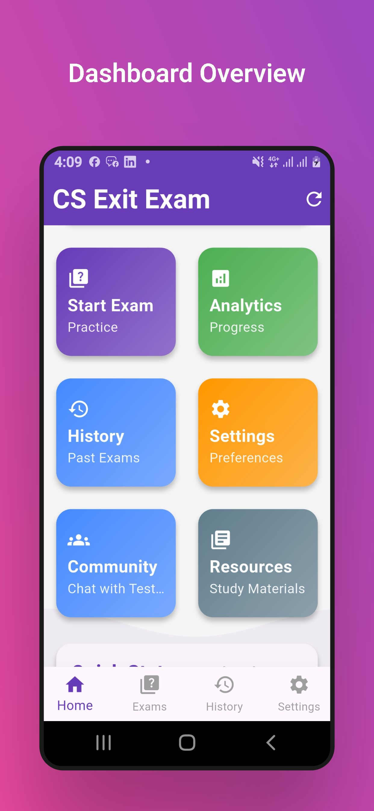
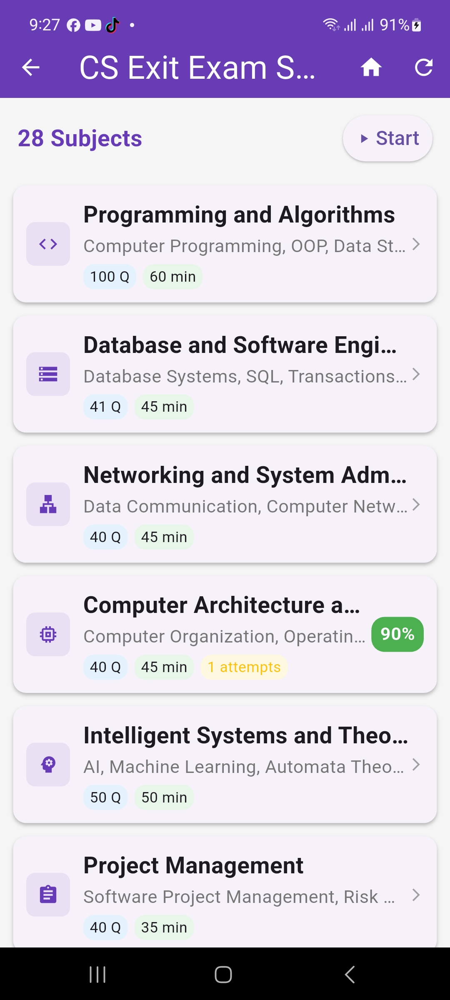
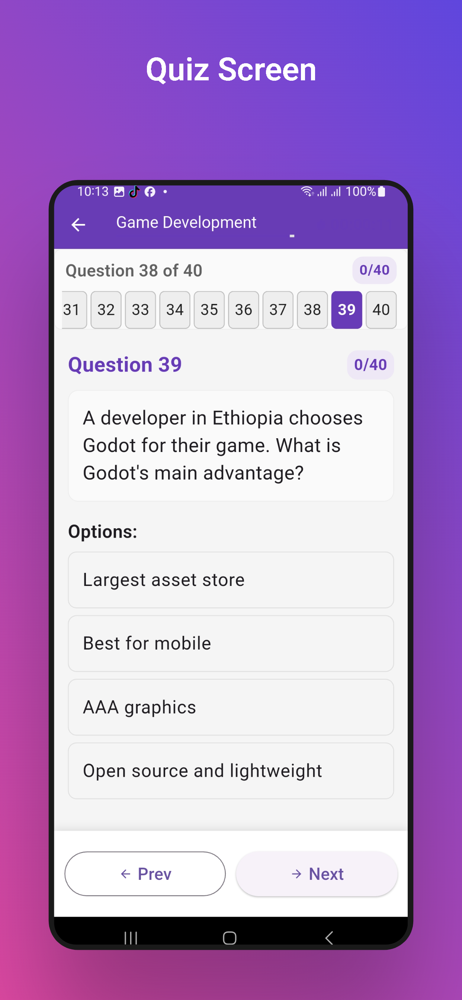
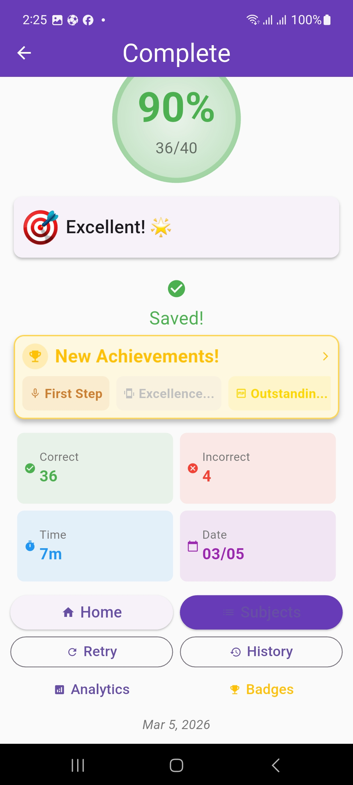

# 🎓 CS Exit Exam Ethiopia

[](https://flutter.dev)
[](https://dart.dev)
[](https://play.google.com/store/apps/details?id=com.yohannes.csexitexam)
[](LICENSE)

**CS Exit Exam Ethiopia** is a comprehensive exam preparation app for Computer Science students in Ethiopia, featuring 1500+ practice questions across 31 subjects, dark mode, offline access, and performance analytics.

---

## 📱 **Screenshots**

<p align="center">
  
  
  
  
</p>

---

## 🚀 **Key Features**

- ✅ **1500+ Practice Questions** across 31 subjects
- ✅ **Offline Mode** – No internet required
- ✅ **Dark Mode** – Eye-friendly study experience
- ✅ **Performance Analytics** – Track your progress
- ✅ **Achievement Badges** – Stay motivated
- ✅ **Previous Years Exams** – Real exam questions
- ✅ **28+ Subjects** – Full CS curriculum coverage

---

## 🏗️ **Technical Architecture**

### Tech Stack

| Technology | Purpose |
|------------|---------|
| **Flutter** | Cross-platform UI framework |
| **Dart** | Programming language |
| **SQLite** | Local database |
| **Provider** | State management |
| **SharedPreferences** | Local storage |

### Architecture Overview
┌─────────────────────────────────────────────────────────┐
│ PRESENTATION LAYER │
│ (Screens, Widgets, UI Components) │
└─────────────────────────────────────────────────────────┘
│
┌─────────────────────────────────────────────────────────┐
│ PROVIDER LAYER │
│ (State Management, Theme, Authentication) │
└─────────────────────────────────────────────────────────┘
│
┌─────────────────────────────────────────────────────────┐
│ SERVICE LAYER │
│ (Database, Storage, Haptic, Notifications) │
└─────────────────────────────────────────────────────────┘
│
┌─────────────────────────────────────────────────────────┐
│ DATA LAYER │
│ (Models, JSON Files, SQLite Tables) │
└─────────────────────────────────────────────────────────┘


### Project Structure
lib/
├── models/ # Data models (Question, Subject, User)
├── screens/ # UI screens (Home, Quiz, Results, etc.)
├── services/ # Business logic (Database, Storage, Haptic)
├── providers/ # State management (ThemeProvider)
├── utils/ # Helper functions (JSON loader, Error handler)
└── widgets/ # Reusable widgets (Progress overlay, etc.)

---

## 🛠️ **Installation & Setup**

### Prerequisites

- Flutter 3.24+
- Dart 3.5+
- Android Studio / VS Code

### Steps

```bash
# 1. Clone the repository
git clone https://github.com/yohannesgd/cs-exit-exam-app-mob.git

# 2. Navigate to the project
cd cs-exit-exam-app-mob

# 3. Get dependencies
flutter pub get

# 4. Run on Android
flutter run

# 5. Build APK
flutter build apk --release
📊 Development Journey
Challenges Faced
Android 13+ Compatibility – Fixed by adding android:exported="true" and updating targetSdk

Dark Mode Issues – Fixed text visibility using Theme.of(context) and isDark checks

Google Play Rejections – Addressed installation issues, signed with correct keystore

Payment Integration – Navigated Ethiopian market challenges with manual distribution

Lessons Learned
🧠 Testing is critical – Test on multiple devices and Android versions

🔑 Keystore management – Always backup your signing keys

📱 User feedback – Listen to users (they requested previous years exams!)

🎯 Persistence – Never give up on debugging

🎯 Future Roadmap
Add 2017, 2018 previous years exams

Real exam simulation with timer

PDF answer sheet generation

Community question contributions

🤝 Contributing
Contributions are welcome! Please read CONTRIBUTING.md first.

📄 License
This project is licensed under the MIT License – see LICENSE for details.

📞 Contact
Developer: Yohannes Gurmu

Email: [nanigurmu65@gmail.com]

LinkedIn: [http://www.linkedin.com/in/yohannes-gurmu-dadi-70167b35a]

⭐ Support the Project
If you find this project useful, please give it a ⭐ on GitHub and share it with Ethiopian CS students!
